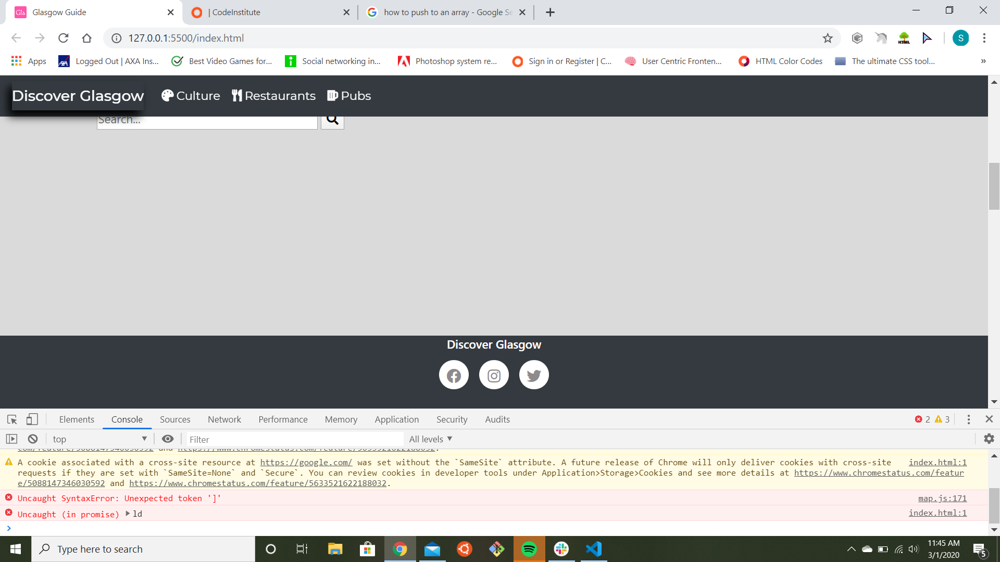

# Discover Glasgow
---
This webpage is intented to promote Glasgow. The sites is intended for short visit, targeting peoples coming for a concert, shopping. It is targeting peoples living near Glasgow or in Scotland to promote tourism within the country. It is separated in three sections,
restaurant, pub and culture.This is from a local point of view, in each section there is three places that are 
 recommended to go to experience the unique, style that Glasgow has to offer.

The webpage goals is to:
* Promote Glasgow locally and nationally.
* To keep the page with limited choices and easy to use, with the idea to implement in the future new top three as new restaurant opens, pub and temporary art exhibition.
  
 The customer goals:
  * Getting recommendation from Glaswegian on where to eat and where to go out.
  * Clear and easy to use webpage.
    
### **Second Milestone. Interactive Frontend. Code Institute.**
---

 ### Demo
 ---
 Click here for live Demo
 [Discover Glasgow](https://mrsebastino.github.io/Second-milestone/ "Discover Glasgow")
  

### UX
---
1. As a user, i want recommendation from a local.

2. As a user, i want an easy to navigate web page.

3. As a user, i want a site that focus on a one day visit rather than long stay.
4.  As a user living nearby i am looking for the hidden that only local have heard of.
5.  As a user i want the site to be recommending new places on a monthly basis.

### Wireframes
---
* Laptop
  
 .jpg)

* Mobile
  
 .jpg)

### Technologies Used
---

* html 
* css 
* JavaScript
* Google map API
* Font Awsome
* Google Font
* JQuery
* POpper.js
* Bootstrap v 4.3.1
* VS Code
  

### Features
 In this project, i used a navbar from Bootstrap as well as the footer, both
 have been customized. I also used a snippets from W3Schools for the dropdown menu, this features as also been customized.

 In the navbar there is a link to each sections, that give a brief description of the section with
 three recommended places to go.
 When the user click on one of the section in dropdown menu, it drop markers to the map with a link to their website.

I have plans to implement a rotating top three every months, as new places open and close fast in the services industry. 
I also have plans to add new sections, possibly Airbnb and local music scene.
### Bug encountered
I have tried to rename the `onClick=myFunction()` with a more explainary name, but it only throw the error of undefined in the console, but work no problem with `myFunction()`. So i ledt the way it is. This is part of the W3School snippet for the dropdown menu.

In my `map.js` i have encountered a bug that if i leave my `[]` empty when defining or iterating it would throw an error in VScode. `Uncaught syntax error unexpected token ']'` and in the Google developer.

I have tried to fix it, i look into google, CI, Slack and Stack everywhere it clearly says we can leaves an empty `[]` , but for some reason, it only works if it's not empty.

### Testing
The sites as been tested using the google chrome Devtol, and on Samsung Galaxy S8,S9, Samsung A8, Ipad Pro, on laptop and on HD 39inch screen. The website is responsive on all platform.
I have manually tested the links to all nine website.

The HTML and CSS have been tested in the W3C validator, the CSS came back no error, and the HTML came back with a warning at line 87 with a lack of heading, but it is not required, it is my map container.

### Deployment
The website is deployed, using GitHub. 

1. Log into [GitHub](https://github.com/Mrsebastino/Second-milestone/)
2. From the menu items near the top of the page, select Settings.
3. Scroll down to the GitHub Pages section.
4. Under Source click the drop-down menu labelled None and select Master Branch
5. On selecting Master Branch the page is automatically refreshed, the website is now deployed.
6. Scroll back down to the GitHub Pages section to retrieve the link to the deployed website.

You can also pull the code locally form my GitHub repository. Go to [GitHub](https://github.com/Mrsebastino/Second-milestone/). Click the `clone or download` button and follow the link provided in HTTPS or download the zipcode and open it from your document folder.

### Credits

##### Contents

The introduction and all the text in the three section,restaurants, pub and culture has been taking from different website promoting Glasgow, i have edited part of the text to take the part that were relevant for my project.

#### Media

All photos are taken from Pexels, except two photos that are from Google.
The icon in the page tab was created with favicon,inpired by the logo that Glasgow did for the Commenwealth game in 2014.

#### Acknowledgements

*I am aware that my `map.js` contain some bad practice of `DRY`, i have tried to rectify it but my knwoledge of Javascript is limited, i did asked for help, and got given many different way to write the section of code i need help with. And rather than submitting an unfinished project, i submitted a non perfectly good practice project, i hope you will undertand.
* I would like to thanks CI for the inpirations on layout and part of the build of the webpage.
* I also make great use of Brad Traversy tutorials on Javascript.
* I would like to thank my mentor Brian Macharia, and everybody at the tutor team and particularly Tim Nelson.

